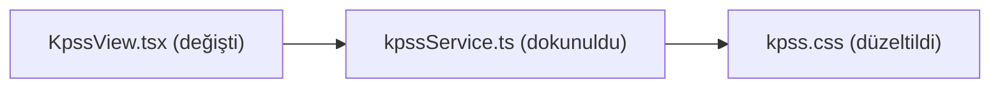

# ZenTodo / Life OS Chrome Extension Development Rules

This file outlines the codebase architecture, design patterns, and coding rules for the AI coding assistants working on the ZenTodo Chrome Extension workspace. Refer to these guidelines to make quick decisions, write aligned code, and avoid token-expensive directory/file scans.

---

## 1. Directory Structure & Architecture

The project is structured as a Vite-bundled modular Preact + TypeScript Chrome Extension:
* **`newtab.html`**: Entry HTML file at the root. Points to `/src/index.tsx`.
* **`src/index.tsx`**: Bootstraps and mounts the Preact `<App />` component inside `#app`.
* **`src/App.tsx`**: The main application file managing global states (active language, timezone clocks, active dashboard routing view, settings configurations, and global task mutators).
* **`src/components/`**: Modular Preact visual view panels:
  * `Sidebar.tsx`: Glassmorphic navigation menu with SVG icons.
  * `ListView.tsx` & `KanbanView.tsx`: Active tasks lists and drag-and-drop Kanban columns.
  * `NotesView.tsx`: Color cards notes taker and custom motivational quotes logs.
  * `PomodoroView.tsx`: SVG countdown timer, stopwatch, and audio alarms.
  * `WillpowerView.tsx`: Discreet self-discipline timer dashboard.
  * `HifizView.tsx` & `SrsView.tsx`: Memorization progress and vocabulary spaced repetition flashcards.
  * `CalendarView.tsx`: Completed tasks schedule grids.
  * `PrayerView.tsx`: City prayer times lookup.
  * `KpssView.tsx`: Subject checklist and Canvas daily progress charts.
  * `FreeGamesView.tsx`: Gaming deals tracker.
* **`src/infrastructure/`**:
  * [persistence/](file:///c:/Users/emre_/Desktop/GitHub/Done/chrome-extension/src/infrastructure/persistence): Chrome storage repository implementations (`ChromeStorageTodoRepository` vb.) — `chrome.storage.sync`/`local` erişimi burada yaşar.
  * [api/](file:///c:/Users/emre_/Desktop/GitHub/Done/chrome-extension/src/infrastructure/api): Google API client'ları (Tasks, Drive, Calendar, Auth).
* **`src/application/`**:
  * [use-cases/](file:///c:/Users/emre_/Desktop/GitHub/Done/chrome-extension/src/application/use-cases): Tek işlemli iş kuralları (AddTodoUseCase, ToggleTodoUseCase, SyncGoogleTasksUseCase).
  * [ports/](file:///c:/Users/emre_/Desktop/GitHub/Done/chrome-extension/src/application/ports): Dış dünya port arayüzleri (ITodoSyncPort, IDriveBackupPort).
* **`src/css/newtab/`**:
  * CSS files divided into feature-specific stylesheets (e.g. `base.css`, `sidebar.css`, `tasks.css`, etc.). Import stylesheet changes in [newtab.css](file:///c:/Users/emre_/Desktop/GitHub/Done/chrome-extension/src/newtab.css).
* **`src/ARCHITECTURE.md`**: CANLI mimari harita — her değişiklikte güncellenir (bkz. bölüm 7).

---

## 2. Core Implementation Rules

### 2.1 CSS & Styling & Design Tokens (Merkezi Tema Sistemi)
* **No Tailwind CSS**: Use vanilla CSS only.
* **Design Tokens & Centralized Theme Mandatory Enforcement**: All colors, fonts, borders, glassmorphic filters, and status colors MUST consume CSS variables defined under `:root` in [base.css](file:///c:/Users/emre_/Desktop/GitHub/Done/chrome-extension/src/css/newtab/base.css) (e.g. `var(--accent-color)`, `var(--stock-up)`, `var(--stock-down)`, `var(--card-bg)`, `var(--card-border)`). Never hardcode ad-hoc hex colors or inline style overrides when a theme token exists. Modifying a token in `base.css` must seamlessly update the entire application theme.
* Write custom styles in modular, domain-specific chunks under `src/css/newtab/<feature>.css` (e.g. `pomodoro.css`, `willpower.css`, `tasks.css`, `stock.css`).
* Respect the dark glassmorphic design system: use vibrant accents, smooth borders, and micro-interactions.
* **No Low-Quality Emojis for Visual Labels**: Emojis like 📈, 📊, 🎯, ⚙️, 🔥, 📅, 🙋‍♂️, 🗑️, 📥, 👑, 🎉 must not be used as visual icons or prefixes in titles/buttons/labels. Always prefer premium custom inline SVGs or clean text representation.

### 2.2 Preact Declarative States (No Manual DOM Queries)
* **Zero Direct DOM Queries**: Do not call `document.getElementById` or `document.querySelector` to update layouts or read values.
* Manage all UI layout modifications, inputs, modals, and visibility indicators declaratively using Preact state hooks (`useState`, `useRef`, `useEffect`).

### 2.3 Storage Management
* Use **`chrome.storage.sync`** for configurations, user lists, and study logs.
* Define get/set wrappers inside [ChromeStorageSettingsRepository](file:///c:/Users/emre_/Desktop/GitHub/Done/chrome-extension/src/infrastructure/persistence/ChromeStorageSettingsRepository.ts) veya ilgili `ChromeStorage*Repository` (infrastructure/persistence/).
* **Important**: When adding a new storage key, append its key name string to the `syncKeys` array in the `migrateLocalToSync` method of `storage.ts` so cloud sync works properly.

### 2.4 Localization (i18n)
* The extension supports English (`en`) and Turkish (`tr`).
* Define all interface strings in the `translations` object inside [i18n.ts](file:///c:/GitHub/Done/chrome-extension/src/utils/i18n.ts).
* Render localized text in TSX using the format `{translations[lang].translation_key}`.

### 2.5 View Routing & Navigation
* Dashboard routing is managed inside [App.tsx](file:///c:/GitHub/Done/chrome-extension/src/App.tsx) via the state variable `activeView`.
* To introduce a new panel, declare it under the `renderActiveViewComponent` router and wire its navigation triggers to [Sidebar.tsx](file:///c:/GitHub/Done/chrome-extension/src/components/Sidebar.tsx).

### 2.6 Path Aliases
* **Module Aliases Requirement**: Always use path alias syntax `@/` for importing internal modules (e.g. `@/infrastructure/...`, `@/components/...`, `@/utils/...`, `@/services/...`, `@/domain/...`) rather than relative directory nesting references (`../../`).

### 2.7 Confirm Dialog Deprecation
* **No browser confirmations**: Do not invoke native browser `confirm()` or alert popups. Always trigger the custom declarative `<ConfirmModal />` component to obtain confirmation actions.

### 2.8 English Naming & Codebase Language Standard (İngilizce Kod ve İsimlendirme Standartı)
* **English Codebase Standard**: All file names (e.g. `ipo.css`, `aiCommandParser.ts`), variable names, function signatures, type interfaces, and CSS class names MUST be written in English to guarantee OS path compatibility, strict Linter/TSC compliance, and clean code standards.
* **Domain-Specific Name Exceptions**: Local Turkish domain-specific terms (such as `kpss` for exam modules and `hifiz` for memorization modules) are permitted as specialized domain names.
* **UI Localization Separation**: User-facing UI text, button titles, modal headers, and notifications MUST be managed dynamically in Turkish & English using the `i18n.ts` localization system (`translations[lang]`).

### 2.9 'Zen' ve Basmakalıp Kelime Yasağı (No Cliché / No 'Zen' Naming Rule)
* **'Zen' ve Jenerik Kelimelerin Yasağı**: 'Zen', 'ZenTodo' gibi jenerik, kalıplaşmış kelimelerin ve jenerik isimlerin yeni kod yazımında ve yeni modüllerde kullanılması KESİNLİKLE YASAKTIR.
* **Özgün ve Benzersiz İsimlendirme**: Tüm yeni modüller, klasörler, projeler, UI bileşenleri ve değişken isimleri için her zaman özgün, profesyonel, anlaşılır ve benzersiz (unique) isimler (örneğin `MindVault`, `ThoughtCraft`, `LifeOS`) seçilmelidir.

### 2.10 Sıfır 'any' Tipi Yasağı (Strict Type Safety — No 'any' Rule)
* **Sıfır 'any' Tipi Garantisi**: Kod tabanında `any` tipi kullanılması KESİNLİKLE YASAKTIR (`@typescript-eslint/no-explicit-any`).
* Tüm değişkenler, fonksiyon parametreleri, API yanıtları ve callback verileri açıkça tanımlanmış interfaces, type aliases veya `unknown` tipi kullanılarak strictly typed olarak yazılmalıdır.

---

## 3. Architecture Philosophy
* Keep feature code modular and decoupled. Avoid framework-heavy states; favor clean functional programming with clear types.
* Verify TypeScript checks and compile the extension using `npm run build`. Load the output `dist/` directory into Chrome.

---

## 4. Quality, Security & Compile Compliance Rules

### 4.1 Zero Compile & Lint Error Tolerance
* **Strict Compiler Checks**: The project must always compile cleanly. Every change must be validated by running `npx tsc --noEmit` and `npx eslint src` to ensure zero compilation and linting errors.
* **Prettier Formatting Compliance**: All code must conform to Prettier formatting guidelines. Run `npx prettier --write src` to clean and unify spacing, indentation, and structure.

### 4.2 Security Audit Rules
* **DOM XSS Injection Prevention**: Never write unescaped user-entered text directly using `.innerHTML` or `dangerouslySetInnerHTML`. Always route strings through `escapeHtml()` sanitization filters before inserting them into active DOM elements in content scripts or rendering blocks.
* **Storage Schema Validation**: Validate all imported external datasets, JSON backups, or sync variables using schema validation libraries (such as Zod schemas) before writing them to Chrome storage.

### 4.3 Structured Planning
* **Planning Workflow Requirement**: Any complex task (architectural changes, multiple file edits, or security revisions) requires establishing a structured plan inside `implementation_plan.md` and waiting for user review and approval before writing code.

### 4.4 Zero Security Vulnerability & Zero Backdoor Guarantee (Sıfır Güvenlik İhlali ve Sıfır Arka Kapı Protokolü)
* **Zero Backdoor Policy**: All code, scripts, network calls, and content script integrations MUST be strictly transparent and free of any backdoor, unauthorized telemetry, hidden data collection, or remote code execution (RCE).
* **Strict Input & DOM Sanitization**: All user-entered text, WhatsApp Web chat messages, or external data inserted into active DOM trees MUST use safe DOM APIs (`document.createElement`, `element.textContent`, `element.setAttribute`) or be sanitized through strict `escapeHtml()` filters to guarantee 0 XSS vulnerabilities.
* **API Key & Credential Safety**: User credentials and API keys (9Router, Gemini, OpenAI, Groq, Ollama) MUST strictly remain stored inside Chrome Extension secure storage (`chrome.storage.sync` / `chrome.storage.local`) and NEVER hardcoded, logged to external servers, or transmitted to unverified endpoints.

---

## 5. Clean Code & Clean Architecture Principles

### 5.1 Separation of Concerns (SoC)
* **Visual Components Boundaries**: Preact elements inside `src/components/` should focus strictly on UI layout representation and simple visual hooks. 
* **Business Logic Relocation**: Storage management, network fetches, calculation formulas, and state providers must reside in separate helper/service classes inside `src/services/`, `src/domain/` veya `src/infrastructure/persistence/`.

### 5.2 Single Responsibility Principle (SRP)
* Keep functions, files, and classes focused on a single responsibility. Do not write monolithic components that merge layout, alarms, storage sync, and custom checkers in one massive scope.
* **Presentational Component Extraction**: Actively split large components (such as `App.tsx` or view pages) by extracting pure presentational code (HTML/JSX markup that relies only on props) into separate modular files under `src/components/` (e.g., `HeroHeader.tsx`, `FooterQuote.tsx`).
* **Bileşen Kompozisyonu / Tuval ve Parça Tasarımı (Layout Assembly Pattern)**: Dev boyutlu arayüz panellerinde (örn. KpssView, PomodoroView) durum (state), veri bağlantısı ve iş mantığı ana kapsayıcıda ("Tuval") tutulmalı, görsel kartlar ve formlar prop tabanlı alt bileşenlere ("Parçalar") bölünerek ayrı dosyalarda yönetilmelidir. Bu, karmaşıklığı azaltır ve kod kaybı riskini yok eder.

### 5.3 Immutable State Management
* Do not mutate Preact states or arrays directly (e.g. `state.push()` or `state[0] = val`). Always enforce immutable update patterns (like mapping, filtering, or spreading arrays: `[...prev, item]`) to guarantee correct reactive updates.

### 5.4 Localization System Fallback Proxy
* When referencing interface strings using localized keys, always import and use `getTranslation(lang)` which returns a Proxy. This Proxy provides safe fallback lookup to English strings if translation keys are missing in the selected language.

### 5.5 Sıfır Kayıp Refactoring Protokolü (Zero-Loss Refactoring Protocol)
* **Özellik & Mantık Koruması (Zero Feature Loss)**: Refactoring işlemlerinde mevcut kodun tüm işlevleri, doğal dil komut ayrıştırıcıları (parsers), API istek akışları, hata sarmalayıcıları (try-catch) ve yan etkileri (side-effects) %100 aynen korunmalıdır. Kenar durumlar (edge cases) silinemez veya basitleştirilemez.
* **Veri & Parametre Koruması**: Fonksiyon imzaları, dışarıdan gelen prop tipleri, veri yapıları ve state isimleri değiştirilmez; veri akışının bozulmaması garanti edilir.
* **Eksiksiz Kod Çıktısı (No Lazy Code)**: Kod yazarken hiçbir zaman `// ... eski kodlar buraya gelecek` veya `// mantık aynı kalıyor` şeklinde kısaltma yapılamaz. Tüm kod ve alt bileşenler baştan sona tam ve çalışır halde sunulmalıdır.
* **Tam Değişiklik İptali & İnceleme**: Refactoring sonrasında `npx tsc --noEmit` ve `npm run build` ile %100 sorunsuz derlendiği doğrulanmalı ve yapılan parçalama işlemlerinin özeti sunulmalıdır.

### 5.6 Modüler CSS ve Temiz Stil Mimarisi (Esnek Modülerlik İlkesi)
* **Esnek Modüler CSS Kuralı**: Sabit/katı satır sayıları yerine okunabilirlik, sürdürülebilirlik ve etki alanı (domain) ayrımı esas alınır. Tek bir dosyada okunabilirliği zorlaştıracak veya farklı sorumlulukları tek bir yerde toplayacak şekilde şişen stiller `src/css/newtab/<feature>/` altında mantıksal alt parçalara bölünmeli (örn: `arcade-base.css`, `arcade-cards.css`, `arcade-modal.css`) ve ana modül CSS'inde `@import` ile birleştirilmelidir.


### 5.7 Gerçekçi Veri ve Sıfır Sahte Statik Veri Protokolü (Zero Hardcoded Fake Data Protocol)
* **Sıfır Sahte / Statik Veri Garantisi**: Kod tabanına, servislere veya veri katmanına kesinlikle elle yazılmış uydurma/sahte statik dummy veriler yerleştirilemez.
* Veriler her zaman dinamik olarak kullanıcı girdisi, gerçek canlı API'ler (`chrome.storage.sync` / `local`) veya kullanıcının kendi yerel projeleri ve yerelleştirilmiş gerçek veri kaynaklarından okunmalı ve yönetilmelidir.

### 4.6 Merkezi ve Tekil AI Yapılandırma Protokolü (Sıfır API Hatası Garantisi)
* **Merkezi AI Yapılandırması Zorunluluğu**: Yeni bir AI özelliği veya arka plan servisi eklenirken asla elle/ad-hoc `chrome.storage` ayrıştırma mantığı yazılmamalıdır. Her zaman `src/services/aiChatService.ts` içerisindeki tekil yetkili `getAIConfigFromStorage()` fonksiyonu kullanılmalıdır.
* **Çift Depolama & Çift Key Garantisi**: Ayarlar kaydedilirken hem `chrome.storage.sync` hem de `chrome.storage.local` depolarına `geminiApiKey` ve `aiApiKey` alanları eşzamanlı yazılır. Böylece hiçbir yeni AI modülü yetki veya anahtar hatası veremez.

### 4.7 Merkezi Loglama Protokolü (Centralized Logging)
* **Ham `console.*` YASAK**: Doğrudan `console.log/warn/error/debug/info` çağrıları yazılamaz. Her zaman `src/utils/logger.ts` içindeki tekil `logger` singleton'ı kullanılır (`import { logger } from "@/utils/logger.js"`). Logger hem console'a hem de `chrome.storage.local`'a (500 entry ring buffer) kaydeder — Ayarlar > Genel > Hata Raporlama'dan `.md` indirilebilir.
* **Sessiz Hata Noktalarına Log Zorunlu (Mandatory)**: Aşağıdaki durumlarda log eklenmesi zorunludur:
  - `chrome.runtime.lastError` kontrolleri → `logger.warn("[Modül] ... lastError:", chrome.runtime.lastError)`
  - `try/catch` bloklarının `catch` kısmı → `logger.error`
  - `sendMessage`/`sendResponse` yanıtsız kalan mesajlar → `logger.warn`
  - Asenkron callback'lerde başarısız fetch/API çağrıları → `logger.error`
* **Log Mesajı Formatı**: `"[ModülAdı] kısa açıklama"` (örn. `"[InfoBox] translate_text lastError:"`). İç log mesajlarındaki Türkçe karakterler i18n kuralından muaftır (kullanıcıya görünmez).
* **Asla Loglanmayacaklar**: API anahtarları, token'lar, şifreler, kimlik bilgileri (bkz. 4.4). Gizli veri loglanacaksa maskelenir (örn. `sk-***`).
* **Asenkron Mesaj Zinciri Kuralı**: `chrome.runtime.onMessage` listener'ı asla `async` yapılmaz (kanal kapanır, callback'teki `sendResponse` kaybolur → "message port closed"). Callback tabanlı `sendResponse` + `return true` deseni kullanılır. Referans: `src/background/backgroundMain.ts`.

---

## 6. Somut Mimari Kurallar (Measurable Architecture Rules)

"Clean code / clean architecture" yazmak tek başına yeterli değildir — bu kurallar **ölçülebilir** ve **denetlenebilir** olmalıdır. Aşağıdaki 3 kural her kod değişikliğinde uygulanır.

### 6.1 Dosya Boyut Limitleri (File Size Limits)
* **View Component'leri ≤ 300 satır**: Bir view (örn. `KpssView.tsx`, `PomodoroView.tsx`) 300 satırı aşarsa ZORUNLU olarak alt bileşenlere bölünür (`src/components/<feature>/` klasörüne). 300 satır üstü her yeni kod, yeni bir alt bileşene taşınır.
* **Service/Helper ≤ 200 satır**: `src/services/`, `src/infrastructure/`, `src/domain/` dosyaları 200 satırı aşarsa bölünür.
* **CSS dosyası ≤ 400 satır**: `src/css/newtab/<feature>.css` 400 satırı aşarsa `src/css/newtab/<feature>/` alt klasörüne bölünür (bkz. 5.6).
* **App.tsx ≤ 300 satır**: Ana bileşen şişerse presentational parçalar (`HeroHeader`, `FooterQuote` vb.) ayrı dosyalara çekilir.

### 6.4 Ölü Dosya Önleme Kuralı (Dead File Prevention)
* **Yeni dosya yazınca ESKİSİNİ SİL**: Bir dosyayı yeni dosyayla değiştirirken (refactor, hook extraction, mimari değişim) eski dosya KESİNLİKLE silinir. "Yeni dosya çalışıyor, eskisi dursun" yasaktır — ölü dosya birikir.
* **Sıfır Ölü Dosya Garantisi**: Her iş sonunda `node scripts/findDeadFiles.mjs` çalıştırılır ve çıktı "Toplam: 0 dosya" olmalıdır. 0 değilse kalanlar silinir (entry noktaları hariç). Script ayrıca **boş klasörleri** ve public/ referanssız asset'leri de raporlar — onlar da silinir.
* **İhlal tespiti**: Bir refactor commit'inde eski dosya hâlâ duruyorsa iş eksiktir.

### 6.5 Klasör Dosya Limiti (Folder File Limit)
* **Klasör ≤ 15 dosya**: Bir klasör 15+ `.ts/.tsx` dosya içeriyorsa, dosyalar tek sorumluluğa sahip değilse feature alt klasörlerine bölünür (örn. `components/kpss/` → `quiz/` + `wiki/` + `srs/`).
* **İstisna**: Klasörün kendisi tek sorumluluk ise (örn. `presentation/hooks/` = "state management", `domain/repositories/` = "interface'ler") dosya sayısı bakım kuralı değildir — bölünmez.
* **Bölme kuralı**: Alt klasör oluştururken import'lar `@/` alias ile güncellenir, `findDeadFiles.mjs` ile 0 ölü dosya doğrulanır.
* **Kök vs Klasör Kararı (Folder Placement)**: Her feature'ın kendi klasörü olması YANLIŞ kuraldır. Dosya yerleşimi:
  * **Çok dosyalı feature** (>3 dosya, aynı domain) → `feature/` klasörü (örn. `services/kpss/`, `components/kpss/quiz/`)
  * **Tek dosyalık feature / giriş noktası** → kökte durur (örn. `ListView.tsx`, `prayerService.ts` — klasör 1 dosyalık şişkinlik olur)
  * **Paylaşılan parçalar** (ConfirmModal, DatePicker) → kök, feature klasörüne gömülmez
  * **View kökleri** (`components/`): ana view'lar `ViewRouter`'dan yönlendirilir, birbirini import etmez — kökte durur = "route listesi" tek bakışta görünür
  * **Alt domain'ler** (kpss: quiz/wiki/srs) → `feature/<domain>/` klasörleri

### 6.2 Katman Bağımlılık Kuralı (Layer Dependency Rule)
* **`components/` ASLA direkt `chrome.storage.*` çağırmaz**: Tüm storage erişimi `src/services/`, `src/infrastructure/persistence/` veya `src/presentation/hooks/` üzerinden yapılır. View component'leri veriyi **prop veya hook** olarak alır.
* **`components/` ASLA direkt `fetch()` çağırmaz**: Network çağrıları `src/services/` içindeki servislerde yaşar.
* **Veri akışı tek yönlüdür**: `services/` → `hooks/` → `components/` (UI). Ters yön yasaktır.
* **İhlal tespiti**: Bir view içinde `chrome.storage.` veya `fetch(` görürsen, o çağrıyı ilgili service'e taşı.

### 6.3 Klasör Haritası (Folder Map)
| Klasör | Sorumluluk | Ne konur |
|---|---|---|
| `src/domain/` | Saf iş mantığı, tipler, sabitler | Hesaplamalar, value objects, constants (UI/storage bağımsız) |
| `src/services/` | Dış dünya ile iletişim | Network fetch, chrome.storage erişimi, AI servisleri, kpssService, errorReportService |
| `src/presentation/hooks/` | State yönetimi | useSettings, useTodos, usePopup, useUI vb. |
| `src/components/` | Sadece UI | View'lar + alt bileşenler (`<feature>/` klasörlerinde) |
| `src/components/<feature>/` | Feature'a özel UI parçaları | kpss/, popup/, settings/, pomodoro/ vb. |
| `src/utils/` | Genel yardımcılar | i18n, logger, formatlayıcılar |
| `src/background/` | Service worker | message handler'lar, alarm'lar |
| `src/content/` | Content script'ler | infobox/, detox/, agent/, whatsapp/ vb. |
| `src/css/` | Stiller | popup.css + newtab/ altında feature CSS'leri |

**Kural**: Yeni dosya oluştururken önce yukarıdaki tablodan doğru klasörü seç. Emin değilsen `src/services/` en güvenli varsayılandır (iş mantığı + storage + network).

---

## 7. Görsel Değişim Raporlama & Mimari Harita Bakımı (Visual Change Reporting)

**Amaç**: Kullanıcı 300+ dosyayı kafasında tutmak zorunda kalmasın. Her iş sonunda AI, değişikliği **görsel** olarak özetler ve mimari haritayı canlı tutar.

### 7.1 `src/ARCHITECTURE.md` Zorunlu Bakım
* **Canlı dokümandır**: Her kod değişikliği sonunda güncellenir.
* Yeni dosya/klasör eklenirse → haritaya eklenir.
* Dosya silinirse → haritadan kaldırılır.
* Sorumluluk değişirse → tablo düzeltilir.
* Yeni feature eklenirse → Feature Haritası'na satır eklenir.

### 7.2 Her İş Sonunda Değişim Diyagramı (Zorunlu)
Her görev tamamlandığında yanıtın sonuna **mermaid flowchart** eklenir:
```
- Hangi dosyalar değişti (dosya adı + satır sayısı)
- Hangi katmanlara dokunuldu (components/ services/ domain/ infrastructure/)
- Yeni bağımlılıklar (X → Y çağırıyor)
```
Format:
````markdown

````

### 7.3 İhlal Tespiti
* Bir iş bitiminde değişim diyagramı yoksa → iş eksiktir.
* ARCHITECTURE.md güncellenmemişse → iş eksiktir.

---

## 8. Brain Klasörü Protokolü (Hafıza & Plan Yönetimi)

**Amaç**: Projenin hafızası `brain/` klasöründe tutulur. AI her işte bu hafızayı okur ve günceller — kullanıcı 300+ dosyayı takip etmek zorunda kalmaz.

### 8.1 Brain Klasörü Kutsaldır
* `brain/` altındaki dosyalar projenin hafızasıdır. **Silme, taşıma veya yeniden adlandırma yalnızca açık talimatla yapılır.**
* Yapı:
```
brain/
├── knowledge.md     ← kalıcı hafıza: mimari, yığın, bağlam
├── task.md          ← görev takibi
└── plans/
   └── plan-NN-YYYY-MM-DD.md  ← sıra numaralı, tarihli planlar
```
Kurallar: `.agents/AGENTS.md` (tek yetkili kaynak).
Mimari harita: `src/ARCHITECTURE.md` (bölüm 7.1 — brain dışında, kod yanında yaşar).

### 8.2 Önce Oku, Sonra Yaz
Göreve başlamadan önce sırasıyla oku:
1. `brain/knowledge.md` — kalıcı bağlam (mimari, standartlar)
2. `brain/task.md` — mevcut görev durumu
3. `src/ARCHITECTURE.md` — canlı mimari harita

### 8.3 Planlar `brain/plans/` Klasörüne Yazılır
* **Karmaşık görev planları buraya yazılır** — `brain/plans/plan-NN-YYYY-MM-DD.md` formatında (NN = o günün sıra numarası, 01'den başlar).
* **Mevcut plan dosyası güncellenmez** — her yeni plan yeni dosyaya yazılır; eski planlar geçmiş olarak korunur.
* Plan onayı: plan yazıldıktan sonra kullanıcı onayı beklenir, sonra uygulanır.

### 8.4 Görev Takibi Şartsız
* Yapılan her iş `brain/task.md`'de işaretlenir.
* "Yaptım ama yazmadım" geçerli değildir.

