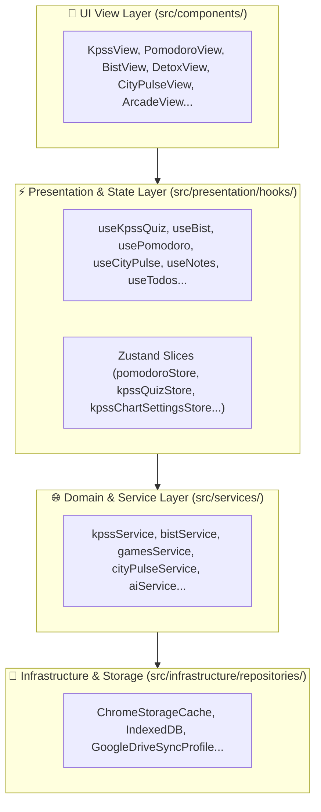

# 🏛️ Architecture & System Design - LifeOS

> **Not:** Detaylı canlı mimari harita için ayrıca [src/ARCHITECTURE.md](file:///c:/Users/Halil%20Emre/Desktop/GitHub/Public/LifeOS/src/ARCHITECTURE.md) dosyasını inceleyebilirsiniz.

## 📌 1. Project Overview
LifeOS (ZenTodo), Chrome New Tab sayfasını kişisel bir işletim sistemine, odaklanma merkezine, KPSS sınav salonuna, borsa takip ekranına ve yapay zeka çalışma asistanına dönüştüren yüksek performanslı bir Manifest V3 Chrome eklentisidir.

## 🛠️ 2. Technology Stack
- **Framework & UI**: Preact / React 19 + TypeScript + Vite
- **Styling**: Vanilla CSS (Modular CSS per view, CSS variables, Glassmorphism, Dark Theme)
- **Charts & Maps**: D3.js (`d3-geo`, GeoJSON) + KaTeX (Mathematical rendering)
- **State Management**: Custom Hook Layer + Zustand Slices (`pomodoroStore`, `kpssStore`, etc.)
- **Storage Layer**: Chrome Extension Storage API (`chrome.storage.local`, `chrome.storage.sync`, `appDataFolder` Google Drive sync)
- **Testing**: Vitest

## 📐 3. Layered Architecture



## 📂 4. Project Layout
```text
src/
├── background/                 # Chrome Service Worker (Alarms, sync, webRequest)
├── offscreen/                  # Offscreen audio & background parsing
├── sidepanel/                  # Chrome SidePanel AI chat & quick tools
├── components/                 # View components & presentational UI
│   ├── kpss/                   # KPSS quiz, exam archive, study targets
│   ├── bist/                   # Stock portfolio, watchlists, alarms
│   ├── citypulse/              # Istanbul cultural event discovery
│   ├── pomodoro/               # Pomodoro timer, stopwatch, zen sounds
│   └── settings/               # Categorized settings & sync config
├── presentation/               # Custom hooks & Zustand state stores
├── services/                   # Business logic, caching, external API services
├── infrastructure/             # Storage repositories & drive sync
├── types/                      # Domain & API TypeScript interfaces
└── i18n/                       # Modular translation system (TR / EN)
```
