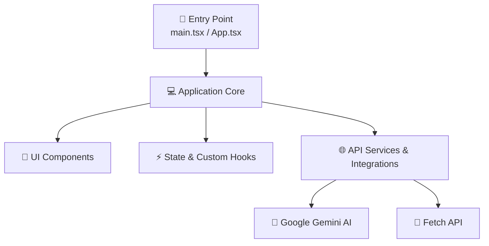

# 🤖 Architecture Overview (Auto-Generated)

> ⚡ **THIS FILE WAS AUTOMATICALLY GENERATED BY AN ARCHITECTURE SCAN SCRIPT.**  
> **Project Name**: `life-os`  
> **Version**: `1.0.0`  
> **Generated Date**: `2026-08-10 20:18`

---

## 📌 1. Executive Summary & Metrics

ZenTodo is a high-end Chrome extension that replaces your New Tab page with a minimalist, focused, and aesthetically pleasing To-Do list environment.

### 📊 Codebase Statistics
- **Total Source Files**: `536`
- **Total Lines of Code (LOC)**: `128,052 lines`
- **UI Components**: `210 files`
- **Custom Hooks**: `19 files`
- **Services / API Handlers**: `66 files`

### 🛠️ Key Technology Stack
- **Vite**
- **TypeScript**

---

## 🗺️ 2. Architectural Flow Diagram




---

## 🔌 3. Integrations, State & Environment

### ⚡ State Management Systems
- `LocalStorage`
- `Zustand`

### 🌐 API Services & Third-Party Integrations
- `Fetch API`
- `Google Gemini AI`

---

## 📂 4. `src/` Directory Tree

```text
src/
├── ARCHITECTURE.md
├── App.tsx
├── application/
│   ├── ports/
│   │   ├── ICalendarSyncPort.ts
│   │   ├── IDriveBackupPort.ts
│   │   ├── IErrorReportPort.ts
│   │   ├── ITodoSyncPort.ts
│   │   ├── createCalendarPort.ts
│   │   └── createSyncPort.ts
│   └── use-cases/
│       ├── settings/
│       ├── sync/
│       └── todo/
├── background/
│   ├── backgroundMain.ts
│   └── handlers/
│       ├── alarmNotificationHandler.ts
│       ├── contextMenuHandler.ts
│       ├── mediaAndTabHandler.ts
│       ├── runtimeMessageHandler.ts
│       └── screentimeTracker.ts
├── components/
│   ├── AIChatView.tsx
│   ├── AppTopHeader.tsx
│   ├── ArcadeView.tsx
│   ├── BistView.tsx
│   ├── CalendarView.tsx
│   ├── ConfirmModal.tsx
│   ├── DatePicker.tsx
│   ├── DetoxView.tsx
│   ├── EisenhowerView.tsx
│   ├── FooterQuote.tsx
│   ├── FreeGamesView.tsx
│   ├── GameCard.tsx
│   ├── HalkaArzView.tsx
│   ├── HeroHeader.tsx
│   ├── HifizView.tsx
│   ├── HistoryCard.tsx
│   ├── KanbanView.tsx
│   ├── KpssCountdownBanner.tsx
│   ├── KpssView.tsx
│   ├── ListView.tsx
│   ├── NotesView.tsx
│   ├── PomoSidePanel.tsx
│   ├── PomodoroView.tsx
│   ├── PrayerView.tsx
│   ├── SettingsDrawer.tsx
│   ├── Sidebar.tsx
│   ├── SrsView.tsx
│   ├── TodoListItem.tsx
│   ├── ViewRouter.tsx
│   ├── WillpowerView.tsx
│   ├── aichat/
│   │   ├── AiChatHeaderBar.tsx
│   │   ├── AiChatInputToolbar.tsx
│   │   ├── AiChatMessageItem.tsx
│   │   ├── AiMessageFooter.tsx
│   │   ├── AiMessageSources.tsx
│   │   ├── AiThinkingCard.tsx
│   │   ├── aiChatIcons.tsx
│   │   ├── localReplyBuilder.ts
│   │   └── useAiChatMessages.ts
│   ├── arcade/
│   │   ├── ArcadeDevTab.tsx
│   │   ├── ArcadeGameCard.tsx
│   │   ├── ArcadeGameModal.tsx
│   │   ├── ArcadeHeader.tsx
│   │   ├── ArcadeModalHeader.tsx
│   │   └── ArcadePlayTab.tsx
│   ├── detox/
│   │   ├── DetoxMotivationCard.tsx
│   │   ├── DetoxStatusCard.tsx
│   │   └── DetoxUsageCard.tsx
│   ├── eisenhower/
│   │   ├── EisenhowerQuadrantCard.tsx
│   │   └── EisenhowerUnclassifiedSidePanel.tsx
│   ├── freegames/
│   │   ├── FreeGamesFilterBar.tsx
│   │   └── WasItFreeSearchTab.tsx
│   ├── hifiz/
│   │   ├── HifizMemorizationCard.tsx
│   │   ├── HifizMushafModal.tsx
│   │   ├── HifizYeterlikModal.tsx
│   │   └── HifizYeterliklerCard.tsx
│   ├── kpss/
│   │   ├── ICONS.md
│   │   ├── archives/
│   │   ├── daily/
│   │   ├── exams/
│   │   ├── kpssIcons.tsx
│   │   ├── map/
│   │   ├── planner/
│   │   ├── quiz/
│   │   ├── srs/
│   │   ├── topics/
│   │   └── wiki/
│   ├── notes/
│   │   ├── CustomQuotesSection.tsx
│   │   ├── GraphLegend.tsx
│   │   ├── GraphSvgCanvas.tsx
│   │   ├── NoteBacklinksPanel.tsx
│   │   ├── NoteCard.tsx
│   │   ├── NoteCardInlineEditor.tsx
│   │   ├── NoteEditorBody.tsx
│   │   ├── NoteEditorHeader.tsx
│   │   ├── NoteEditorModal.tsx
│   │   ├── NotesDayScorePanel.tsx
│   │   ├── NotesFilterBar.tsx
│   │   ├── NotesHeaderBar.tsx
│   │   ├── QuoteEditorModal.tsx
│   │   ├── WikiAutocomplete.tsx
│   │   └── ZettelkastenGraphModal.tsx
│   ├── pomodoro/
│   │   ├── PomoAlarmsCard.tsx
│   │   ├── PomoAmbientPlayerCard.tsx
│   │   ├── PomoHeaderTabs.tsx
│   │   ├── PomoStopwatchCard.tsx
│   │   ├── PomoTimerCard.tsx
│   │   ├── PomoZenElementSvgs.tsx
│   │   ├── PomoZenGardenCard.tsx
│   │   ├── PomoZenHistoryCard.tsx
│   │   ├── PomodoroControls.tsx
│   │   ├── PomodoroDurationEditor.tsx
│   │   └── PomodoroRing.tsx
│   ├── popup/
│   │   ├── DetoxPlatformGrid.tsx
│   │   ├── PopupDetoxTab.tsx
│   │   ├── PopupPomoTab.tsx
│   │   ├── PopupVolumeTab.tsx
│   │   ├── detoxPlatforms.tsx
│   │   └── pomo/
│   ├── prayer/
│   │   └── PrayerCityForm.tsx
│   ├── settings/
│   │   ├── AiSettingsTab.tsx
│   │   ├── AppHotkeySelect.tsx
│   │   ├── AppSettingsGroup.tsx
│   │   ├── AppShortcutRow.tsx
│   │   ├── AppToggleRow.tsx
│   │   ├── BridgeToggles.tsx
│   │   ├── DetoxSettingsTab.tsx
│   │   ├── ErrorReportSettingsTab.tsx
│   │   ├── GeneralSettingsTab.tsx
│   │   ├── KpssAutoTitleToggle.tsx
│   │   ├── KpssResetSection.tsx
│   │   ├── KpssSettingsTab.tsx
│   │   ├── KpssTargetSettingsGroup.tsx
│   │   ├── SettingsSection.tsx
│   │   ├── SyncSettingsTab.tsx
│   │   └── ai/
│   ├── sidebar/
│   │   ├── SidebarIcons.tsx
│   │   └── SidebarNavItem.tsx
│   └── stock/
│       ├── analysis/
│       ├── chart/
│       ├── common/
│       ├── explore/
│       ├── news/
│       ├── portfolio/
│       ├── search/
│       └── watchlist/
├── content/
│   ├── agent/
│   │   └── domAgentEngine.ts
│   ├── contentLogger.ts
│   ├── contentMain.ts
│   ├── detox/
│   │   ├── BlockerUI.ts
│   │   ├── SiteMatcher.ts
│   │   └── detoxBlocker.ts
│   ├── infobox/
│   │   └── universalInfoBox.ts
│   ├── quiz/
│   │   ├── QuizParser.ts
│   │   ├── QuizRenderer.ts
│   │   ├── QuizStorage.ts
│   │   └── quizPanel.ts
│   ├── telegram/
│   │   └── telegramBridge.ts
│   ├── volume/
│   │   └── volumeBooster.ts
│   └── whatsapp/
│       └── whatsappBridge.ts
├── css/
│   ├── newtab/
│   │   ├── ai-chat.css
│   │   ├── ambient.css
│   │   ├── arcade/
│   │   ├── arcade.css
│   │   ├── base.css
│   │   ├── calendar.css
│   │   ├── confirm.css
│   │   ├── datepicker.css
│   │   ├── detox.css
│   │   ├── eisenhower.css
│   │   ├── free-games.css
│   │   ├── game-history.css
│   │   ├── google-sync.css
│   │   ├── halka-arz.css
│   │   ├── hifiz.css
│   │   ├── kpss-external-quiz.css
│   │   ├── kpss-quiz.css
│   │   ├── kpss.css
│   │   ├── mushaf.css
│   │   ├── notes.css
│   │   ├── pomodoro.css
│   │   ├── prayer.css
│   │   ├── sidebar.css
│   │   ├── sidepanel.css
│   │   ├── srs.css
│   │   ├── stock.css
│   │   ├── tasks.css
│   │   ├── willpower.css
│   │   └── zen-garden.css
│   └── popup.css
├── domain/
│   ├── constants/
│   │   ├── TurkeyGeographyData.ts
│   │   ├── TurkeyHistoryData.ts
│   │   ├── TurkeyProvincePaths.ts
│   │   ├── geography/
│   │   ├── history/
│   │   ├── kpssConstants.ts
│   │   ├── kpssCurriculum.ts
│   │   ├── kpssSrsDefaultCards.ts
│   │   ├── memoryConstants.ts
│   │   ├── prayerConstants.ts
│   │   └── sidebarConstants.ts
│   ├── data/
│   │   └── hifizData.ts
│   ├── entities/
│   │   └── Todo.ts
│   ├── repositories/
│   │   ├── IAiConfigRepository.ts
│   │   ├── IArcadeRepository.ts
│   │   ├── IBistCacheRepository.ts
│   │   ├── IGamesCacheRepository.ts
│   │   ├── IKapNewsCacheRepository.ts
│   │   ├── IKpssRepository.ts
│   │   ├── IMemoryRepository.ts
│   │   ├── INoteRepository.ts
│   │   ├── IPrayerCacheRepository.ts
│   │   ├── IQuestionBankRepository.ts
│   │   ├── ISettingsRepository.ts
│   │   ├── ISrsProgressRepository.ts
│   │   ├── IStockRepository.ts
│   │   ├── ISyncRepository.ts
│   │   ├── ITodoRepository.ts
│   │   └── IWikiNoteRepository.ts
│   ├── services/
│   │   ├── KpssCalculatorService.ts
│   │   ├── SrsService.ts
│   │   ├── TaskService.ts
│   │   └── detoxMotivationalService.ts
│   └── value-objects/
│       ├── Language.ts
│       ├── RepeatType.ts
│       └── TodoStatus.ts
├── index.tsx
├── infrastructure/
│   ├── adapters/
│   │   └── ChromeErrorReportAdapter.ts
│   ├── api/
│   │   ├── GoogleAuthApi.ts
│   │   ├── GoogleCalendarApi.ts
│   │   ├── GoogleDriveApi.ts
│   │   └── GoogleTasksApi.ts
│   ├── persistence/
│   │   └── repositories/
│   ├── services/
│   │   └── PomodoroManagerService.ts
│   └── storage/
│       └── keys.ts
├── newtab.css
├── offscreen/
│   └── offscreenAudio.ts
├── popup.tsx
├── presentation/
│   ├── hooks/
│   │   ├── useAiUserMemory.ts
│   │   ├── useBist.ts
│   │   ├── useCalendar.ts
│   │   ├── useDetox.ts
│   │   ├── useEisenhower.ts
│   │   ├── useFreeGames.ts
│   │   ├── useHifiz.ts
│   │   ├── useKpssChartMetric.ts
│   │   ├── useKpssChartSettings.ts
│   │   ├── useKpssQuiz.ts
│   │   ├── useKpssWikiSidebar.ts
│   │   ├── useNotes.ts
│   │   ├── usePomodoro.ts
│   │   ├── usePopup.ts
│   │   ├── usePrayer.ts
│   │   ├── useSidebarOrder.ts
│   │   ├── useSrs.ts
│   │   ├── useTabVolume.ts
│   │   └── useWillpower.ts
│   └── store/
│       ├── aiUserMemoryStore.ts
│       ├── detoxStore.ts
│       ├── hifizStore.ts
│       ├── kpssChartMetricStore.ts
│       ├── kpssChartSettingsStore.ts
│       ├── kpssQuizStore.ts
│       ├── kpssWikiSidebarStore.ts
│       ├── notesStore.ts
│       ├── pomodoroStore.ts
│       ├── popupStore.ts
│       ├── prayerStore.ts
│       ├── settingsStore.ts
│       ├── srsStore.ts
│       ├── syncStore.ts
│       ├── tabVolumeStore.ts
│       ├── todosStore.ts
│       ├── uiStore.ts
│       └── willpowerStore.ts
├── services/
│   ├── agentToolService.ts
│   ├── aichat/
│   │   ├── actionExecutor.ts
│   │   ├── index.ts
│   │   ├── modelFetcher.ts
│   │   ├── prompts/
│   │   ├── providers.ts
│   │   ├── systemPrompt.ts
│   │   └── types.ts
│   ├── ambientAudioService.ts
│   ├── arcade/
│   │   ├── arcadeFileSystem.ts
│   │   ├── arcadeGameLauncher.ts
│   │   ├── arcadeHtmlRewriter.ts
│   │   ├── arcadeService.ts
│   │   ├── index.ts
│   │   └── types.ts
│   ├── bistService.ts
│   ├── errorReportService.ts
│   ├── gamesService.ts
│   ├── ipoService.ts
│   ├── kapNewsService.ts
│   ├── kpss/
│   │   ├── data/
│   │   ├── kpssAiService.ts
│   │   ├── kpssExternalQuizService.ts
│   │   ├── kpssPrompts.ts
│   │   ├── kpssQuestionBankService.ts
│   │   ├── kpssQuizFlowService.ts
│   │   ├── kpssQuizService.ts
│   │   ├── kpssService.ts
│   │   ├── kpssSrsService.ts
│   │   ├── kpssWikiService.ts
│   │   └── prompts/
│   ├── prayerService.ts
│   ├── stock/
│   │   ├── prompts/
│   │   ├── stockAiService.ts
│   │   ├── stockPrompts.ts
│   │   └── stockRuleEngine.ts
│   ├── vocabulary/
│   │   ├── categories.ts
│   │   ├── loader.ts
│   │   └── personal.ts
│   ├── vocabularyService.ts
│   ├── webSearchAgent.ts
│   └── zettelkastenEngine.ts
├── sidepanel/
│   ├── ChatMessage.ts
│   ├── SidePanelApp.tsx
│   ├── SidePanelChips.tsx
│   ├── SidePanelHeader.tsx
│   ├── SidePanelInputBar.tsx
│   ├── SidePanelMessages.tsx
│   ├── SidePanelTabBar.tsx
│   ├── index.tsx
│   ├── sidePanelSpeech.ts
│   ├── sidePanelStorage.ts
│   └── useSidePanelChat.ts
├── sidepanel.css
├── types/
│   ├── bist.ts
│   ├── css.d.ts
│   ├── dom.d.ts
│   ├── game.ts
│   ├── games.ts
│   ├── kap.ts
│   ├── kpss.ts
│   ├── prayer.ts
│   ├── stock.ts
│   ├── types.ts
│   └── word.ts
├── utils/
│   ├── aiCommandParser.ts
│   ├── cloudBackup.ts
│   ├── dateUtils.ts
│   ├── i18n.ts
│   ├── kpssChartDrawer.ts
│   ├── logger.ts
│   ├── markdownRenderer.ts
│   ├── sanitize.ts
│   └── translations/
│       ├── en/
│       └── tr/
└── vite-env.d.ts
```

---

## 🔍 5. Core Modules & Directory Breakdown

### 🏁 Application Entry Points
- Core entry files: `App.tsx, index.tsx` 

### 📁 Primary Source Modules
| Directory | Purpose / Category | File Count |
| :--- | :--- | :--- |
| `src/application/` | Application components and modules | 0 files |
| `src/background/` | Background components and modules | 1 files |
| `src/components/` | Components components and modules | 30 files |
| `src/content/` | Content components and modules | 2 files |
| `src/css/` | Css components and modules | 1 files |
| `src/domain/` | Domain components and modules | 0 files |
| `src/infrastructure/` | Infrastructure components and modules | 0 files |
| `src/offscreen/` | Offscreen components and modules | 1 files |
| `src/presentation/` | Presentation components and modules | 0 files |
| `src/services/` | Services components and modules | 11 files |
| `src/sidepanel/` | Sidepanel components and modules | 11 files |
| `src/types/` | Types components and modules | 11 files |
| `src/utils/` | Utils components and modules | 8 files |

---

## ⚙️ 6. Maintainability & Code Conventions

1. **Modular Architecture**: Separate UI components from business logic (`hooks/`, `services/`, `logic/`).
2. **Type Safety**: Maintain strict TypeScript interfaces in `src/types/` or `types.ts`.
3. **Environment Security**: Keep API keys in `.env` files and access via `process.env` or `import.meta.env`.

---
*Auto-generated by Architecture Scanner for `life-os`.*
