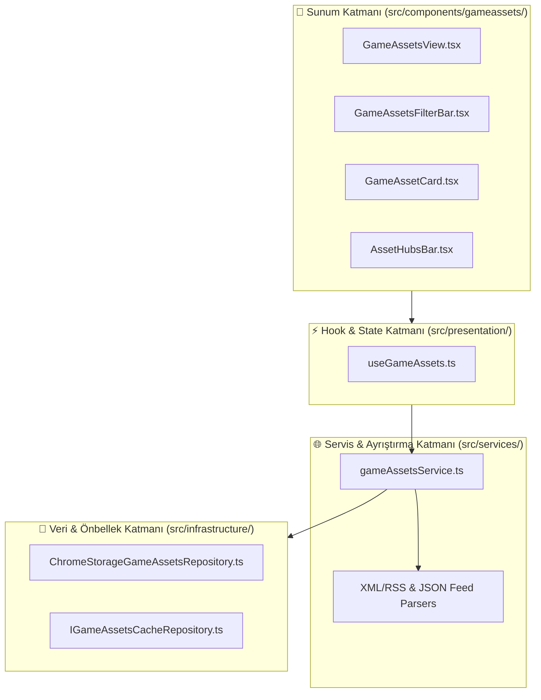

# 🎨 Ücretsiz Oyun Assetleri (Free Game Assets) Modülü Uygulama Planı

Bu belge, **Free Games (Ücretsiz Oyunlar)** sayfasına benzer şekilde, oyun geliştiricileri ve meraklıları için **Ücretsiz Oyun Assetleri (2D Sprite, 3D Model, Ses/Müzik, UI, Kaplama/Doku, Bundle/Loot)** sunan yeni bir modülün araştırma bulgularını ve mimari uygulama planını içerir.

---

## 🔍 İnternet ve API Araştırma Bulguları (Radical Truth)

Oyun assetleri dünyasında Steam/Epic gibi merkezi tek bir REST API bulunmamaktadır. Ancak yaptığımız canlı testler ve araştırmalar sonucunda **doğrudan çalışan, hızlı ve ücretsiz** 4 temel veri kanalı ve 1 küratörlü dizin tespit edilmiştir:

| Kaynak | Protokol / Format | Sağlanan Veri & İçerik | Durum & Güvenilirlik |
| :--- | :--- | :--- | :--- |
| **Itch.io Free Game Assets** | RSS/XML (`/game-assets/free.xml`, `/tag-2d.xml`, `/tag-3d.xml`, `/tag-audio.xml`, `/tag-gui.xml`, `/on-sale.xml`) | Popüler 2D, 3D, Ses, UI ve %100 indirimli paketler. Başlık, görsel (`imageurl`), indirme linki, yazar ve etiketler. | ✅ **Yüksek Güven**: Canlı test edildi (HTTP 200). Sürekli güncel. |
| **Kenney.nl Feed** | RSS/XML (`kenney.nl/feed`) | %100 CC0 Public Domain (Ticari dahil sınırsız kullanım) yüksek kaliteli 2D/3D/Ses paketleri. | ✅ **Yüksek Güven**: Canlı test edildi (HTTP 200). Temiz kapak görseli (`enclosure`) ve metaveri. |
| **OpenGameArt.org** | RSS/XML (`opengameart.org/rss.xml`) | Topluluk açık kaynaklı 2D, 3D, müzik, ses efektleri ve konsept çizimler. | ✅ **Yüksek Güven**: Canlı test edildi (HTTP 200). Açık kaynak lisanslı içerikler. |
| **GamerPower Loot API** | REST JSON (`gamerpower.com/api/giveaways?type=loot`) | Ücretsiz DLC'ler, soundtrack'ler, in-game asset paketleri ve promolar. | ✅ **Yüksek Güven**: Canlı test edildi (JSON döner). |
| **Küratörlü Varlık Portalları (Quick Hubs)** | Doğrudan Entegrasyon | Poly Pizza (3D CC0), Game-Icons.net (SVG), Epic Games Fab Free, Unity Asset Store Free, AmbientCG (PBR Textures), Mixamo vb. | ✅ **Yüksek Fayda**: Tek tıkla derin arama ve doğrudan varlık keşfi. |

---

## 🏛️ Mimari Tasarım & Katmanlar

LifeOS'in Clean Architecture ve Single Responsibility Principle (SRP) kurallarına uygun olarak modül şu katmanlarla inşa edilecektir:

---

## 📋 Önerilen Değişiklikler

### 1. Tip ve Arayüz Tanımları
#### [NEW] [src/types/gameAssets.ts](file:///c:/Users/Halil%20Emre/Desktop/GitHub/Public/LifeOS/src/types/gameAssets.ts)
- `GameAssetItem`: Başlık, açıklama, kapak resmi, indirme bağlantısı, kaynak (itch.io, kenney, opengameart, gamerpower), kategori (2D, 3D, Audio, UI, Texture, Loot), lisans (CC0, Free, Attribution), yayın tarihi.
- `AssetCategory`: `"all" | "2d" | "3d" | "audio" | "ui" | "textures" | "loot"`
- `AssetSource`: `"all" | "itch" | "kenney" | "opengameart" | "gamerpower"`
- `CachedAssetsData`: `timestamp` + `data: GameAssetItem[]`

---

### 2. Repository & Servis Katmanı
#### [NEW] [src/domain/repositories/IGameAssetsCacheRepository.ts](file:///c:/Users/Halil%20Emre/Desktop/GitHub/Public/LifeOS/src/domain/repositories/IGameAssetsCacheRepository.ts)
- `getAssetsCache()`, `setAssetsCache(data)`, `loadClaimedAssetIds()`, `saveClaimedAssetIds(ids)`.

#### [NEW] [src/infrastructure/persistence/repositories/ChromeStorageGameAssetsRepository.ts](file:///c:/Users/Halil%20Emre/Desktop/GitHub/Public/LifeOS/src/infrastructure/persistence/repositories/ChromeStorageGameAssetsRepository.ts)
- Chrome Storage tabanlı, 20 dakikalık TTL önbellekleme ve offline fallback.

#### [NEW] [src/services/gameAssetsService.ts](file:///c:/Users/Halil%20Emre/Desktop/GitHub/Public/LifeOS/src/services/gameAssetsService.ts)
- Itch.io RSS (`free.xml`, `tag-2d.xml`, vb.), Kenney Feed (`kenney.nl/feed`), OpenGameArt RSS ve GamerPower Loot endpoint'lerini paralel olarak çeken, XML'leri hafif DOMParser/Regex ile normalize edip birleştiren servis.

---

### 3. State & Hook Katmanı
#### [NEW] [src/presentation/hooks/useGameAssets.ts](file:///c:/Users/Halil%20Emre/Desktop/GitHub/Public/LifeOS/src/presentation/hooks/useGameAssets.ts)
- Kategori filtresi (2D, 3D, Audio, UI, Texture, Loot).
- Kaynak filtresi (Itch, Kenney, OpenGameArt, GamerPower).
- Arama sorgusu (Canlı başlık ve etiket filtreleme).
- "Kaydedildi / İndirildi" işaretleme (`claimedIds`) durumu.

---

### 4. Bileşen & Görünüm Katmanı
#### [NEW] [src/components/gameassets/AssetHubsBar.tsx](file:///c:/Users/Halil%20Emre/Desktop/GitHub/Public/LifeOS/src/components/gameassets/AssetHubsBar.tsx)
- Poly Pizza, Kenney, Itch.io, Fab, Unity Asset Store, Game-Icons, AmbientCG için doğrudan hızlı arama/keşif kısayolları.

#### [NEW] [src/components/gameassets/GameAssetsFilterBar.tsx](file:///c:/Users/Halil%20Emre/Desktop/GitHub/Public/LifeOS/src/components/gameassets/GameAssetsFilterBar.tsx)
- Kategori sekmeleri (2D, 3D, Ses, UI vb.), kaynak filtreleri ve anlık arama kutusu.

#### [NEW] [src/components/gameassets/GameAssetCard.tsx](file:///c:/Users/Halil%20Emre/Desktop/GitHub/Public/LifeOS/src/components/gameassets/GameAssetCard.tsx)
- Kapak resmi, kaynak rozeti (Itch.io / Kenney / OpenGameArt / GamerPower), lisans etiketi, kategori ikonu, "Varlığa Git" ve "İndirildi / Kaydet" butonları.

#### [NEW] [src/components/GameAssetsView.tsx](file:///c:/Users/Halil%20Emre/Desktop/GitHub/Public/LifeOS/src/components/GameAssetsView.tsx)
- Ana sayfa birleştirici bileşeni (Layout Assembly).

---

### 5. Entegrasyon ve CSS
#### [NEW] [src/css/newtab/game-assets.css](file:///c:/Users/Halil%20Emre/Desktop/GitHub/Public/LifeOS/src/css/newtab/game-assets.css)
- Glassmorphic kartlar, etiket stilleri, responsive grid ve modern arayüz tasarımı.

#### [MODIFY] [src/newtab.css](file:///c:/Users/Halil%20Emre/Desktop/GitHub/Public/LifeOS/src/newtab.css)
- `@import "./css/newtab/game-assets.css";` eklenmesi.

#### [MODIFY] [src/components/ViewRouter.tsx](file:///c:/Users/Halil%20Emre/Desktop/GitHub/Public/LifeOS/src/components/ViewRouter.tsx)
- `"game-assets"` rotasının ve lazy import'unun eklenmesi.

#### [MODIFY] [src/components/Sidebar.tsx](file:///c:/Users/Halil%20Emre/Desktop/GitHub/Public/LifeOS/src/components/Sidebar.tsx) & [src/components/sidebar/SidebarIcons.tsx](file:///c:/Users/Halil%20Emre/Desktop/GitHub/Public/LifeOS/src/components/sidebar/SidebarIcons.tsx)
- Sidebar'a "Game Assets" (Oyun Varlıkları) ikonu ve navigasyonunun eklenmesi.

#### [MODIFY] [src/domain/constants/sidebarConstants.ts](file:///c:/Users/Halil%20Emre/Desktop/GitHub/Public/LifeOS/src/domain/constants/sidebarConstants.ts)
- Varsayılan sıralamaya `"game-assets"` eklenmesi.

#### [MODIFY] [src/utils/translations/tr/](file:///c:/Users/Halil%20Emre/Desktop/GitHub/Public/LifeOS/src/utils/translations/tr/) & [src/utils/translations/en/](file:///c:/Users/Halil%20Emre/Desktop/GitHub/Public/LifeOS/src/utils/translations/en/)
- TR ve EN dil sözlüklerine sayfa başlıkları, filtreler ve buton etiketlerinin eklenmesi.

---

## 🧪 Doğrulama ve Test Planı

### Otomatik Testler
- `npm run build` ile TypeScript tür kontrolü ve Vite derleme testi.
- `npx vitest run` ile mevcut birim testlerinin regülasyon kontrolü.

### Manuel Doğrulama
- Sidebar üzerinden "Game Assets" sayfasına geçiş yapılması.
- Canlı feed'lerin (Itch.io, Kenney, OpenGameArt, GamerPower) başarıyla yüklendiğinin ve kartların render edildiğinin doğrulanması.
- Kategori filtrelerinin (2D, 3D, Audio, UI) ve arama kutusunun anlık filtreleme yaptığının test edilmesi.
- "İndirildi / Kaydedildi" butonuna tıklandığında durumun Chrome Storage'a kaydedilip sekme yenilendiğinde korunduğunun teyit edilmesi.
- Quick Hubs bağlantılarının yeni sekmede doğru açıldığının kontrolü.
