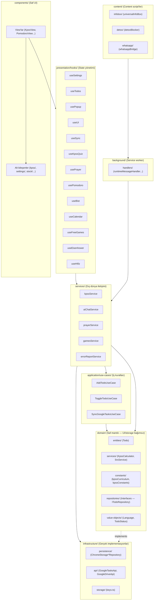

# Life OS Mimari Haritası

> **Bu dosya CANLI'dır.** Her kod değişikliğinde güncellenir:
> yeni dosya/klasör eklenirse eklenir, silinen kaldırılır, sorumluluk değişirse düzeltilir.
> Gerçek kaynak: `src/` dizini. Bu doküman onunla birebir eşleşmelidir.

---

## 1. Katman Diyagramı



---

## 2. Klasör Sorumlulukları

| Klasör | Sorumluluk | Ne konur | Asla konmaz |
|---|---|---|---|
| `src/components/` | Saf UI görünümü | View'lar + `<feature>/` alt bileşenleri | `chrome.storage`, `fetch`, iş mantığı |
| `src/components/<feature>/` | Feature'a özel UI parçaları | kpss/, settings/, stock/, pomodoro/, notes/... | — |
| `src/presentation/hooks/` | State yönetimi, view-model | useSettings, useTodos, usePopup, useUI | DOM, fetch |
| `src/presentation/view-models/` | UI'a hazır veri dönüşümü | TodoViewModel | — |
| `src/services/` | Dış dünya iletişimi | Network fetch, chrome.storage, AI servisleri, kpssService, errorReportService | JSX |
| `src/application/use-cases/` | Tek işlemli iş kuralları | AddTodoUseCase, SyncGoogleTasksUseCase | UI, storage detayı |
| `src/application/ports/` | Dış dünya arayüz tanımları | ITodoSyncPort, IDriveBackupPort | — |
| `src/domain/entities/` | Çekirdek iş nesneleri | Todo | — |
| `src/domain/value-objects/` | Değer tipleri | Language, TodoStatus, RepeatType | — |
| `src/domain/repositories/` | Depo arayüzleri (contract) | ITodoRepository, IKpssRepository | Implementasyon |
| `src/domain/services/` | Saf hesaplama servisleri | KpssCalculatorService, SrsService, TaskService | chrome.* |
| `src/domain/constants/` | Sabit veriler | kpssCurriculum, kpssConstants, kpssFlashcards | — |
| `src/domain/data/` | Domain verisi | hifizData | — |
| `src/infrastructure/persistence/` | chrome.storage implementasyonları | ChromeStorage*Repository | UI |
| `src/infrastructure/api/` | Google API client'ları | GoogleTasksApi, GoogleDriveApi, GoogleAuthApi | — |
| `src/infrastructure/services/` | Altyapı servisleri | PomodoroManagerService | — |
| `src/infrastructure/storage/` | Storage key sabitleri | keys.ts | — |
| `src/background/` | Service worker | backgroundMain, handlers/ | DOM |
| `src/content/` | Content script'ler | infobox/, detox/, agent/, whatsapp/, telegram/, volume/ | — |
| `src/utils/` | Genel yardımcılar | i18n, logger, formatlayıcılar | İş mantığı |
| `src/utils/translations/` | UI metinleri | en.ts, tr.ts | — |
| `src/types/` | Tip tanımları | types.ts, kpss.ts, stock.ts, bist.ts... | — |
| `src/data/` | Statik veri dosyaları | kpss/ (eski sınav JSON'ları) | — |
| `src/offscreen/` | Offscreen doküman | offscreenAudio | — |
| `src/sidepanel/` | Side panel UI | index, SidePanelApp | — |
| `src/css/` | Stiller | popup.css + newtab/ feature CSS'leri | — |

---

## 3. Veri Akışı (Tek Yön)

**Todo oluşturma örneği:**

```
Kullanıcı → ListView.tsx (UI)
  → useTodos (hook)
    → TodoRepository (domain interface)
      → ChromeStorageTodoRepository (infrastructure)
        → chrome.storage.sync
```

**Kural (AGENTS.md 6.2):** Veri akışı tek yönlüdür:
`components/ → hooks/ → services/ → infrastructure/`
Ters yön (component içinde `chrome.storage` veya `fetch`) **yasaktır**.

---

## 4. Feature Haritası

| View (component) | Ana service | Storage | Alt bileşenler |
|---|---|---|---|
| ListView / KanbanView | todo repo (application/use-cases) | sync | — |
| PomodoroView | PomodoroManagerService, usePomodoro (hook) | local | pomodoro/ (8) |
| KpssView | kpssService, kpssQuizService, kpssAiService, useKpssQuiz (hook) | sync+local | kpss/ (24) — KpssProgressSection progress tab'ı yönetir |
| HifizView | hifizData (domain/data), useHifiz (hook) | sync | hifiz/ (4) |
| SrsView | kpssSrsService, SrsService | sync | — |
| CalendarView | todo repo, GoogleCalendarApi, useCalendar (hook) | sync | — |
| PrayerView | prayerService, usePrayer (hook) | sync | prayer/ (1) — PrayerCityForm |
| Stock/BistView | bistService, stockAiService, useBist (hook) | local | stock/ (17) |
| FreeGamesView | gamesService, useFreeGames (hook) | local | freegames/ (2) |
| NotesView | zettelkastenEngine | sync | notes/ (7) |
| AIChatView | aiChatService | sync+local | aichat/ (4) |
| ArcadeView | arcadeService | local | arcade/ (3) |
| DetoxView | detoxBlocker (content) | sync | detox/ (3) |
| WillpowerView | — | sync | — |
| EisenhowerView | todo repo, useEisenhower (hook) | sync | eisenhower/ (2) + eisenhower.css |
| SettingsDrawer | settings repos | sync | settings/ (6) |
| Sidebar | useUI | sync | sidebar/ (2) |

---

## 5. Content Script & Background Akışı

```
Sayfa (herhangi bir web sitesi)
  → content.js (contentMain)
    → universalInfoBox / detoxBlocker / whatsappBridge...
      → chrome.runtime.sendMessage({type: "..."})
        → background.js (backgroundMain)
          → runtimeMessageHandler (translate_text, execute_agent_action...)
            → services/ (fetch, storage)
              → sendResponse geri
```

**Kritik kural:** `onMessage` listener asla `async` yapılmaz — callback + `return true` deseni kullanılır (kanal kapanmasın diye). Detay: `src/background/backgroundMain.ts`.

---

## 6. Güncelleme Protokolü

Bu harita **her değişiklikte** güncellenir:

1. **Yeni dosya** eklendi → ilgili klasöre satır ekle
2. **Dosya silindi** → haritadan kaldır
3. **Sorumluluk değişti** → tabloyu düzelt
4. **Yeni feature** eklendi → Feature Haritası'na satır ekle
5. **Yeni klasör** → Klasör Sorumlulukları tablosuna ekle

Doğrulama: `npm run build` + `npx tsc --noEmit` her değişiklikte çalıştırılır.
