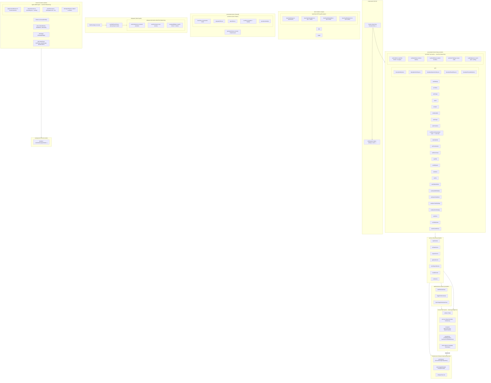

# Life OS Mimari Haritası

> **Bu dosya CANLI'dır.** Her kod değişikliğinde güncellenir:
> yeni dosya/klasör eklenirse eklenir, silinen kaldırılır, sorumluluk değişirse düzeltilir.
> Gerçek kaynak: `src/` dizini. Bu doküman onunla birebir eşleşmelidir.

---

## 1. Katman Diyagramı



---

## 2. Klasör Sorumlulukları

| Klasör                                         | Sorumluluk                        | Ne konur                                                                                                                               | Asla konmaz                           |
| ---------------------------------------------- | --------------------------------- | -------------------------------------------------------------------------------------------------------------------------------------- | ------------------------------------- |
| `src/components/`                              | Saf UI görünümü                   | View'lar + `<feature>/` alt bileşenleri                                                                                                | `chrome.storage`, `fetch`, iş mantığı |
| `src/components/kpss/`                         | KPSS not stüdyosu UI'si           | wiki/, quiz/ bileşenleri; notlar chrome.storage'da tutulur, MD indirme var                                                             | —                                     |
| `src/components/<feature>/`                    | Feature'a özel UI parçaları       | kpss/quiz/, kpss/wiki/, settings/, stock/, pomodoro/...                                                                                | —                                     |
| `src/components/rss/`                          | RSS görünüm alt bileşenleri       | RssFeedList.tsx, RssItemList.tsx                                                                                                       | State                                 |
| `src/presentation/hooks/`                      | State yönetimi, view-model        | useSettings, useTodos, useBist + bist/ alt-hook'lar                                                                                    | DOM, fetch                            |
| `src/presentation/hooks/bist/`                 | BIST alt-hook'ları (modüler)      | usePortfolio, useWatchlists, useStockRules, useStockTrading, useBistQuotes                                                              | JSX, direkt DOM                       |
| `src/services/`                                | Dış dünya iletişimi               | Network fetch, chrome.storage, AI servisleri, kpss/, stock/, errorReportService                                                        | JSX                                   |
| `src/application/use-cases/`                   | Tek işlemli iş kuralları          | AddTodoUseCase, SyncGoogleTasksUseCase                                                                                                 | UI, storage detayı                    |
| `src/application/ports/`                       | Dış dünya arayüz tanımları        | ITodoSyncPort, IDriveBackupPort                                                                                                        | —                                     |
| `src/domain/entities/`                         | Çekirdek iş nesneleri             | Todo                                                                                                                                   | —                                     |
| `src/domain/value-objects/`                    | Değer tipleri                     | Language, TodoStatus, RepeatType                                                                                                       | —                                     |
| `src/domain/repositories/`                     | Depo arayüzleri (contract)        | ITodoRepository, IKpssRepository, IUserSyncProfileRepository                                                                           | Implementasyon                        |
| `src/domain/services/`                         | Saf hesaplama servisleri          | KpssCalculatorService, SrsService, TaskService                                                                                         | chrome.*                              |
| `src/domain/constants/`                        | Sabit veriler                     | kpssCurriculum, kpssConstants, TurkeyProvincePaths, history/ (kurtulusSavasiUnit — 21 adım)                                             | —                                     |
| `src/infrastructure/persistence/repositories/` | chrome.storage implementasyonları | ChromeStorage*Repository (incl. ChromeStorageUserSyncProfileRepository)                                                                 | UI                                    |
| `src/infrastructure/api/`                      | Google API client'ları            | GoogleTasksApi, GoogleDriveApi, GoogleAuthApi                                                                                          | —                                     |
| `src/presentation/store/`                      | Zustand store'lar                 | pomodoroStore.ts (4-slice kompozisyon)                                                                                                 | JSX                                   |
| `src/presentation/store/pomodoro/`             | Pomodoro slice'lar (Slice Pattern)| timerSlice, stopwatchSlice, alarmSlice, zenSlice, pomodoroNotify                                                                       | JSX, DOM                              |
| `src/infrastructure/storage/`                  | Storage key sabitleri             | keys.ts                                                                                                                                | —                                     |
| `src/background/`                              | Service worker                    | backgroundMain, handlers/                                                                                                              | DOM                                   |
| `src/content/`                                 | Content script'ler                | infobox/, detox/, agent/ (pageContextExtractor, elementScanner, actionExecutor, domAgentEngine barrel), whatsapp/, quiz/                | —                                     |
| `src/content/agent/`                           | DOM Agent (modüler)               | pageContextExtractor.ts (context), elementScanner.ts (overlay), actionExecutor.ts (click/type/scroll), domAgentEngine.ts (barrel)      | İş mantığı                            |
| `src/utils/`                                   | Genel yardımcılar                 | i18n, logger, formatlayıcılar, sanitize, kpssChartDrawer + kpssChartCalculations + kpssChartRenderBar + kpssChartRenderLine              | İş mantığı                            |
| `src/types/`                                   | Tip tanımları                     | types.ts, kpss.ts, stock.ts, bist.ts...                                                                                                | —                                     |
| `src/sidepanel/`                               | Side panel UI (Web Copilot)       | SidePanelApp (tuval), useSidePanelChat (kompozisyon), useChatSession, useVoiceInput, useAgentBridge                                     | —                                     |
| `src/css/`                                     | Stiller                           | popup.css + newtab/ feature CSS'leri                                                                                                   | —                                     |

---

## 3. Veri Akışı (Tek Yön)

**Todo oluşturma örneği:**

```
Kullanıcı → ListView.tsx (UI)
  → useTodos (hook)
    → TodoRepository (domain interface)
      → ChromeStorageTodoRepository (infrastructure)
        → chrome.storage.sync
```

**Sync profile örneği (prayerCity / willpowerStreak / detox):**

```
Kullanıcı → PrayerView.tsx (UI)
  → usePrayer (store)
    → IUserSyncProfileRepository (domain interface)
      → ChromeStorageUserSyncProfileRepository (infrastructure)
        → chrome.storage.sync
```

**BIST veri akışı (God File Refactoring):**

```
Kullanıcı → BistView.tsx (UI)
  → useBist (tuval - 5 alt-hook)
    → usePortfolio (portfolio CRUD + hesaplar)
    → useWatchlists (izleme listeleri)
    → useStockRules (alarm kuralları)
    → useStockTrading (trade + nakit)
    → useBistQuotes (canlı fiyat + polling)
      → ChromeStorageStockRepository (infrastructure)
        → chrome.storage.sync
```

**Pomodoro Slice Pattern örneği:**

```
Kullanıcı → PomodoroView.tsx (UI)
  → usePomodoroState (Zustand store)
    → timerSlice (pomodoro timer + mode)
    → stopwatchSlice (kronometre)
    → alarmSlice (alarm listesi)
    → zenSlice (garden history + plant)
      → PomodoroManagerService (infrastructure)
        → chrome.storage.local
```

**Kural (AGENTS.md 6.2):** Veri akışı tek yönlüdür: `components/ → hooks/ → services/ → infrastructure/`
Ters yön (component içinde `chrome.storage` veya `fetch`) **yasaktır**.

---

## 4. Feature Haritası

| View (component)      | Ana service                                                    | Storage    | Alt bileşenler                                                                                     |
| --------------------- | -------------------------------------------------------------- | ---------- | -------------------------------------------------------------------------------------------------- |
| ListView / KanbanView | todo repo                                                      | sync       | —                                                                                                  |
| PomodoroView          | PomodoroManagerService, usePomodoro                            | local      | pomodoro/ (11)                                                                                     |
| KpssView              | kpssService, kpssQuizService, kpssAiService, useKpssQuiz       | sync+local | kpss/quiz/, kpss/wiki/, kpss/map/ (TurkeyMapView + HistoryMapView)                                 |
| HifizView             | hifizData, useHifiz                                            | sync       | hifiz/ (4)                                                                                         |
| SrsView               | kpssSrsService, SrsService, useSrs                             | sync       | —                                                                                                  |
| CalendarView          | todo repo, GoogleCalendarApi, useCalendar                      | sync       | —                                                                                                  |
| PrayerView            | prayerService, usePrayer                                       | sync+local | prayer/ (1)                                                                                        |
| Stock/BistView        | bistService, stockAiService, useBist (tuval → 5 alt-hook)      | sync       | stock/ (30)                                                                                        |
| FreeGamesView         | gamesService, useFreeGames                                     | local      | freegames/ (2)                                                                                     |
| NotesView             | zettelkastenEngine, useNotes                                   | sync       | notes/ (16)                                                                                        |
| AIChatView            | aiChatService                                                  | sync+local | aichat/ (10)                                                                                       |
| ArcadeView            | arcadeService                                                  | local      | arcade/ (6)                                                                                        |
| DetoxView             | detoxBlocker, distractionCleaner                               | sync+local | detox/ (5)                                                                                         |
| RssView               | rssService                                                     | sync+local | RssView.tsx (tuval)                                                                                |
| WillpowerView         | useWillpower                                                   | sync+local | —                                                                                                  |
| EisenhowerView        | todo repo, useEisenhower                                       | sync       | eisenhower/ (2)                                                                                    |
| SettingsDrawer        | settings repos                                                 | sync       | settings/ (15)                                                                                     |
| Sidebar               | useUI                                                          | sync       | sidebar/ (2)                                                                                       |
| SidePanel (Copilot)   | useSidePanelChat (tuval → 3 alt-hook)                          | sync       | sidepanel/ (ChatMessage, Header, TabBar, Chips, Messages, InputBar)                                |

---

## 5. Content Script & Background Akışı

```
Sayfa (herhangi bir web sitesi)
  → content.js (contentMain)
    → agent/ (pageContextExtractor → elementScanner → actionExecutor)
    → universalInfoBox / detoxBlocker / whatsappBridge...
      → chrome.runtime.sendMessage({type: "..."})
        → background.js (backgroundMain)
          → runtimeMessageHandler (translate_text, execute_agent_action...)
            → services/ (fetch, storage)
              → sendResponse geri
```

**Kritik kural:** `onMessage` listener asla `async` yapılmaz — callback + `return true` deseni kullanılır.

---

## 6. Güncelleme Protokolü

Bu harita **her değişiklikte** güncellenir:
1. **Yeni dosya** eklendi → ilgili klasöre satır ekle
2. **Dosya silindi** → haritadan kaldır
3. **Sorumluluk değişti** → tabloyu düzelt
4. **Yeni feature** eklendi → Feature Haritası'na satır ekle

Doğrulama: `npm run build` + `npx tsc --noEmit` her değişiklikte çalıştırılır.
