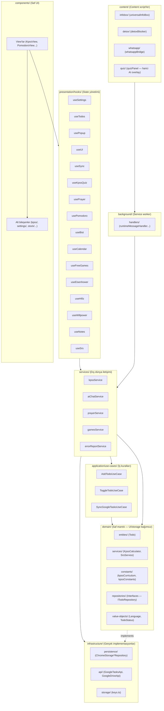

# Life OS Mimari Haritası

> **Bu dosya CANLI'dır.** Her kod değişikliğinde güncellenir:
> yeni dosya/klasör eklenirse eklenir, silinen kaldırılır, sorumluluk değişirse düzeltilir.
> Gerçek kaynak: `src/` dizini. Bu doküman onunla birebir eşleşmelidir.

---

## 1. Katman Diyagramı



---

## 2. Klasör Sorumlulukları

| Klasör                            | Sorumluluk                        | Ne konur                                                                      | Asla konmaz                           |
| --------------------------------- | --------------------------------- | ----------------------------------------------------------------------------- | ------------------------------------- |
| `src/components/`                 | Saf UI görünümü                   | View'lar + `<feature>/` alt bileşenleri                                       | `chrome.storage`, `fetch`, iş mantığı |
| `desktop/`                      | Electron masaüstü sarmalayıcı    | main.js, preload.js (chrome API mock), build.js, package.json | —            |
| `src/components/<feature>/`       | Feature'a özel UI parçaları       | kpss/quiz/, kpss/wiki/, settings/, stock/, pomodoro/...                       | —                                     |
| `src/presentation/hooks/`         | State yönetimi, view-model        | useSettings, useTodos, usePopup, useUI                                        | DOM, fetch                            |
| `src/services/`                   | Dış dünya iletişimi               | Network fetch, chrome.storage, AI servisleri, kpss/, stock/, errorReportService | JSX                                  |
| `src/application/use-cases/`      | Tek işlemli iş kuralları          | AddTodoUseCase, SyncGoogleTasksUseCase                                        | UI, storage detayı                    |
| `src/application/ports/`          | Dış dünya arayüz tanımları        | ITodoSyncPort, IDriveBackupPort                                               | —                                     |
| `src/domain/entities/`            | Çekirdek iş nesneleri             | Todo                                                                          | —                                     |
| `src/domain/value-objects/`       | Değer tipleri                     | Language, TodoStatus, RepeatType                                              | —                                     |
| `src/domain/repositories/`        | Depo arayüzleri (contract)        | ITodoRepository, IKpssRepository                                              | Implementasyon                        |
| `src/domain/services/`            | Saf hesaplama servisleri          | KpssCalculatorService, SrsService, TaskService                                | chrome.*                              |
| `src/domain/constants/`           | Sabit veriler                     | kpssCurriculum, kpssConstants, kpssFlashcards, TurkeyGeographyData, TurkeyProvincePaths | —                                     |
| `src/domain/data/`                | Domain verisi                     | hifizData                                                                     | —                                     |
| `src/infrastructure/persistence/repositories/` | chrome.storage implementasyonları | ChromeStorage*Repository  | UI                  |
| `src/infrastructure/persistence/migrations/`   | Yerel→sync geçişi                 | LocalToSyncMigration       | —                   |
| `src/infrastructure/api/`         | Google API client'ları            | GoogleTasksApi, GoogleDriveApi, GoogleAuthApi                                 | —                                     |
| `src/infrastructure/services/`    | Altyapı servisleri                | PomodoroManagerService                                                        | —                                     |
| `src/infrastructure/storage/`     | Storage key sabitleri             | keys.ts                                                                       | —                                     |
| `src/background/`                 | Service worker                    | backgroundMain, handlers/                                                     | DOM                                   |
| `src/content/`                    | Content script'ler                | infobox/, detox/, agent/, whatsapp/, telegram/, volume/, quiz/                | —                                     |
| `src/utils/`                      | Genel yardımcılar                 | i18n, logger, formatlayıcılar                                                 | İş mantığı                            |
| `src/utils/translations/`         | UI metinleri                      | en.ts, tr.ts                                                                  | —                                     |
| `src/types/`                      | Tip tanımları                     | types.ts, kpss.ts, stock.ts, bist.ts...                                       | —                                     |
| `src/data/`                       | Statik veri dosyaları             | kpss/ (eski sınav JSON'ları)                                                  | —                                     |
| `src/offscreen/`                  | Offscreen doküman                 | offscreenAudio                                                                | —                                     |
| `src/sidepanel/`                  | Side panel UI (Web Copilot)       | index, SidePanelApp (tuval ~90), useSidePanelChat (hook), SidePanelHeader/TabBar/Chips/Messages/InputBar (parçalar), ChatMessage (tip) | —                                     |
| `src/css/`                        | Stiller                           | popup.css + newtab/ feature CSS'leri                                          | —                                     |

---

## 3. Veri Akışı (Tek Yön)

**Todo oluşturma örneği:**

```
Kullanıcı → ListView.tsx (UI)
  → useTodos (hook)
    → TodoRepository (domain interface)
      → ChromeStorageTodoRepository (infrastructure)
        → chrome.storage.sync
```

**Kural (AGENTS.md 6.2):** Veri akışı tek yönlüdür:
`components/ → hooks/ → services/ → infrastructure/`
Ters yön (component içinde `chrome.storage` veya `fetch`) **yasaktır**.

---

## 4. Feature Haritası

| View (component)      | Ana service                                                     | Storage    | Alt bileşenler                                          |
| --------------------- | --------------------------------------------------------------- | ---------- | ------------------------------------------------------- |
| ListView / KanbanView | todo repo (application/use-cases), TodoListItem, dateUtils      | sync       | —                                                       |
| PomodoroView          | PomodoroManagerService, usePomodoro (hook)                      | local      | pomodoro/ (8)                                           |
| KpssView              | kpssService, kpssQuizService, kpssAiService, useKpssQuiz (hook) | sync+local | kpss/quiz/ (8) + kpss/wiki/ (8 — hiyerarşik parentId ağacı; KpssNotesDashboard=tuval + useKpssNotes hook + Header/Toolbar/HelpModal parçaları) + kpss/obsidian/ (2) + kpss/srs/ (1) + kpss/map/ (4 — TurkeyMapView=tuval + MapControls/MapCanvas/MapTopicSidebar) + kpss/ (11 — KpssSrsTab dahil) |
| HifizView             | hifizData (domain/data), useHifiz (hook)                        | sync       | hifiz/ (4)                                              |
| SrsView               | kpssSrsService, SrsService, useSrs (hook)                       | sync       | —                                                       |
| CalendarView          | todo repo, GoogleCalendarApi, useCalendar (hook)                | sync       | —                                                       |
| PrayerView            | prayerService, usePrayer (hook)                                 | sync       | prayer/ (1) — PrayerCityForm                            |
| Stock/BistView        | bistService, stockAiService, useBist (hook)                     | sync      | stock/ (19) + stock/kesfet/ (4 — BistKesfetTab parçaları) + services/stock/ (3) |
| FreeGamesView         | gamesService, useFreeGames (hook)                               | local      | freegames/ (2)                                          |
| NotesView             | zettelkastenEngine, useNotes (hook)                             | sync       | notes/ (13 — NoteCard=tuval+NoteCardInlineEditor, NoteEditorModal=tuval+Header/Body/WikiAutocomplete/BacklinksPanel) |
| AIChatView            | aiChatService (services/aichat/ — providers, systemPrompt, actionExecutor) | sync+local | aichat/ (4)                                             |
| ArcadeView            | arcadeService (arcade/ — fileSystem, htmlRewriter, gameLauncher, types) | local      | arcade/ (3)                                             |
| DetoxView             | detoxBlocker (content)                                          | sync       | detox/ (3)                                              |
| WillpowerView         | useWillpower (hook)                                             | sync       | —                                                       |
| EisenhowerView        | todo repo, useEisenhower (hook)                                 | sync       | eisenhower/ (2) + eisenhower.css                        |
| SettingsDrawer        | settings repos                                                  | sync       | settings/ (9) + settings/ai/ (3 — AiSettingsTab parçaları)                     |
| Sidebar               | useUI                                                           | sync       | sidebar/ (2)                                            |

---

## 5. Content Script & Background Akışı

```
Sayfa (herhangi bir web sitesi)
  → content.js (contentMain)
    → universalInfoBox / detoxBlocker / whatsappBridge...
      → chrome.runtime.sendMessage({type: "..."})
        → background.js (backgroundMain)
          → runtimeMessageHandler (translate_text, execute_agent_action...)
            → services/ (fetch, storage)
              → sendResponse geri
```

**Kritik kural:** `onMessage` listener asla `async` yapılmaz — callback + `return true` deseni kullanılır (kanal kapanmasın diye). Detay: `src/background/backgroundMain.ts`.

---

## 6. Güncelleme Protokolü

Bu harita **her değişiklikte** güncellenir:

1. **Yeni dosya** eklendi → ilgili klasöre satır ekle
2. **Dosya silindi** → haritadan kaldır
3. **Sorumluluk değişti** → tabloyu düzelt
4. **Yeni feature** eklendi → Feature Haritası'na satır ekle
5. **Yeni klasör** → Klasör Sorumlulukları tablosuna ekle

Doğrulama: `npm run build` + `npx tsc --noEmit` her değişiklikte çalıştırılır.
